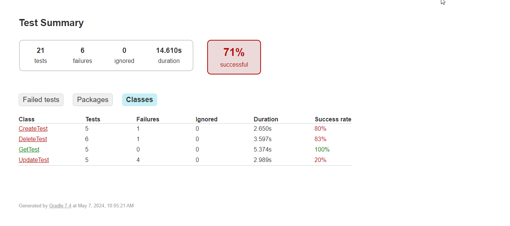

# Aplikasi Automation Testing pada Web Dummy API

## Daftar Isi
- [Deskripsi](#deskripsi)
- [Prasyarat](#prasyarat)
- [Cara Menjalankan](#cara-menjalankan)
- [Struktur Folder Project Setelah Program Dijalankan](#struktur-folder-project-setelah-program-dijalankan)
- [Pengujian dan Generate Report dengan TestNG](#pengujian-dan-generate-report-dengan-testng)
- [Pengembang](#pengembang)
- [Alat](#alat)

## Deskripsi
Proyek ini adalah aplikasi pengujian otomatis untuk Web Dummy API menggunakan Java, Gradle, dan TestNG. Pengujian dilakukan untuk memastikan fungsi-fungsi API bekerja sesuai yang diharapkan.
Proyek ini terdiri dari empat kelas utama: 

1. **CreateTest:** Berisi modul melakukan pengujian terhadap HTTP method create.
2. **GetTest:** Berisi modul melakukan pengujian terhadap HTTP method get.
3. **UpdateTest:** Berisi modul melakukan pengujian terhadap HTTP method update.
4. **DeleteTest:** Berisi modul melakukan pengujian terhadap HTTP method delete.

Setiap modul/method yang terkandung dalam keempat kelas utama tersebut dapat dilihat pada tabel berikut:

### Modul Aplikasi
Pengujian dilakukan permodul dengan daftar item pengujian berikut:

| No. | Nama Modul   | Jumlah TC |
|-----|--------------|-----------|
| 1   | `CreateTest` | 5         |
| 2   | `GetTest`    | 5         |
| 3   | `UpdateTest` | 5         |
| 4   | `DeleteTest` | 6         |

## Prasyarat

1. Pastikan untuk mengklon repository ini ke dalam direktori lokal Anda dengan perintah:
    ```
    https://github.com/yasminazizahtuhfah/B3_API-Testing.git
    ```
   Ini akan mendownload salinan proyek ke komputer Anda.

2. Pastikan Anda telah menginstal Node.js. Anda dapat mengunduh dan menginstal Node.js dari situs resminya: [Node.js Download](https://nodejs.org/).

   Untuk memeriksa apakah Node.js sudah terinstal, jalankan perintah berikut di terminal:
    ```
    node -v
    ```

3. Pastikan Anda telah menginstal Java JDK versi 16. Anda dapat mengunduh dan menginstal Java JDK dari situs resminya: [Java SE Development Kit 16 Downloads](https://www.oracle.com/java/technologies/javase-jdk16-downloads.html).

   Untuk memeriksa apakah Java JDK sudah terinstal, jalankan perintah berikut di terminal:
    ```
    java -version
    ``` 

4. Pastikan sudah terinstal Gradle. Anda dapat mengunduh dan menginstal Gradle dari situs resminya: [Gradle Installation Guide](https://gradle.org/install/).

   Untuk memeriksa apakah Gradle sudah terinstal, jalankan perintah berikut di terminal:
    ```
    gradle -v
    ```

5. (Opsional) Proyek ini menggunakan TestNG untuk melakukan pengujian otomatis, Anda dapat menginstalnya dengan cara:
    - Untuk pengguna Eclipse, Anda bisa mendownload dan menginstal TestNG dari Eclipse Marketplace.
    - IntelliJ IDEA biasanya sudah menyertakan dukungan untuk TestNG tanpa instalasi tambahan

6. Pastikan telah mengonfigurasi RestAssured. Tambahkan dependensi RestAssured ke dalam file build.gradle:
   gradle :
    ```
    implementation group: 'io.rest-assured', name: 'rest-assured', version: '4.4.0'
    }
    ```
## Cara Menjalankan

1. Buka proyek dengan IDE favorit Anda. Disarankan untuk menggunakan IntelliJ IDEA untuk kenyamanan pengembangan.

2. Lakukan build proyek untuk menyiapkan aplikasi dengan perintah build di IDE Anda atau dengan perintah:
    ```
    npm run build
    ```

3. Generate file-file Gradle yang diperlukan dengan perintah:
    ```
    npm run wrapper
    ```

4. Jalankan program untuk melakukan pengujian manual dengan perintah:
    ```
    npm start
    ```
   Ini akan menjalankan program dalam mode pengembangan atau sesuai dengan skrip start yang telah dikonfigurasi.

5. Lakukan pengujian otomatis dengan perintah:
    ```
    npm test
    ```
   Ini akan menjalankan skrip pengujian otomatis yang telah disiapkan untuk proyek.

## Struktur Folder Project Setelah Program Dijalankan
Berikut struktur folder project setelah program dijalankan hingga step npm test:
```
├── .gradle
├── build
│   ├── ...
│   ├── reports
|   |   └── tests
|   │   |    ├── ...
|   │   |    ├── index.html
|   |   │    └── testng-results.xml
|   └── ...
├── gradle
└── src
    ├── main
    │   └── java
    │       └── org
    │           └── Main.java
    └── test
        ├── java
        │   ├── CreateTest.java
        │   ├── DeleteTest.java
        │   ├── GetTest.java
        │   ├── TestHelper.java
        │   ├── UpdateTest.java
        └── resources
            └── testng.xml
```

## Pengujian dan Generate Report dengan TestNG
Pengujian dilakukan menggunakan TestNG dan RestAssured untuk memastikan fungsi-fungsi API bekerja sesuai yang diharapkan.Laporan hasil pengujian akan digenerate secara otomatis. Laporan ini terletak pada file berikut: `build/reports/tests/index.html`. Hasil pengujiannya sebagai berikut:

- Total test: <span style="color:#2196F3; font-weight:bold;">21</span>
- Successful: <span style="color:#4CAF50; font-weight:bold;">15 (71%)</span>
- Failures: <span style="color:#F44336; font-weight:bold;">6 (29%)</span>
- Igroned: <span style="color:#FFC107; font-weight:bold;">0</span>



## Pengembang
[](https://github.com/delvitord)
[](https://github.com/mentarialysias)
[](https://github.com/yasminazizahtuhfah)


<b>Delvito Rahim Derivansyah - 211524039 ([@delvitord](https://github.com/delvitord))
<br> Mentari Ayu Alysia Sudrajat - 211524047 ([@mentarialysias](https://github.com/mentarialysias))
<br> Yasmin Azizah Tuhfah - 211524064 ([@yasminazizahtuhfah](https://github.com/yasminazizahtuhfah))
<b>
## Alat
- 
  <br>Digunakan sebagai alat pembangunan untuk mengelola proyek Java dengan efisien. Kunjungi [situs web Gradle](https://gradle.org/) untuk informasi lebih lanjut.


- 
  <br>Versi 16 atau yang lebih baru</span>. Bahasa pemrograman Java digunakan dalam proyek ini. Pastikan untuk menginstal versi Java yang sesuai. Kunjungi [situs web Java](https://www.java.com/) untuk informasi lebih lanjut.


- 
  <br>Framework pengujian</span> yang digunakan untuk menulis dan menjalankan unit tes dalam proyek Java. Kunjungi [situs web TestNG](https://testng.org/) untuk informasi lebih lanjut.


- 
  <br>Platform runtime JavaScript</span> yang digunakan untuk menjalankan aplikasi JavaScript di sisi server. Pastikan Node.js telah diinstal untuk menjalankan aplikasi. Kunjungi [situs web Node.js](https://nodejs.org/) untuk informasi lebih lanjut.


- 
  <br>RestAssured adalah library Java yang kuat untuk melakukan pengujian API secara otomatis. Dengan RestAssured, Anda dapat dengan mudah melakukan permintaan HTTP ke endpoint API, memeriksa respons, dan memvalidasi data JSON. Kunjungi dokumentasi RestAssured untuk informasi lebih lanjut.
